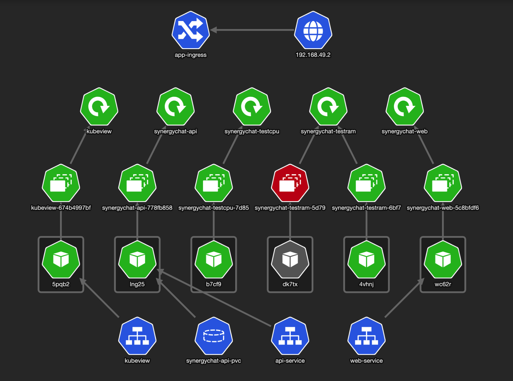

# k8s-refresher
A repo to brush up on K8s. It follows the Learn Kubernetes course on [boot.dev](https://www.boot.dev).

## In This Document:
  - [About the Course](#about-the-course)
   
## About the Course
In this course, Lane Wagner covers the following K8s areas, sharing his valuable experience along the way:
1. Installation
1. Pods
1. Deployments
1. ConfigMaps
1. Services
1. Ingress
1. Storage
1. Namespaces
1. Scaling
1. Nodes

[Up](README.md)

